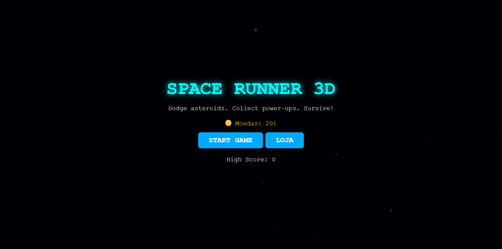
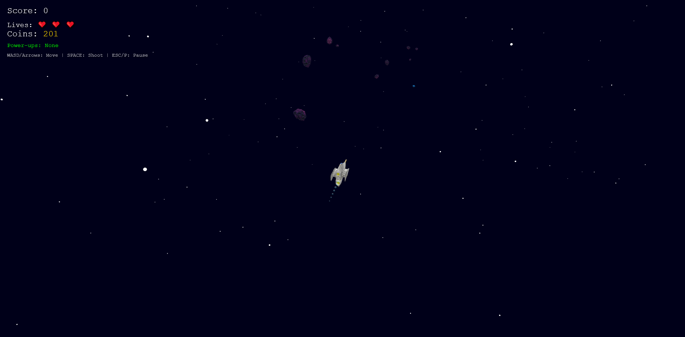
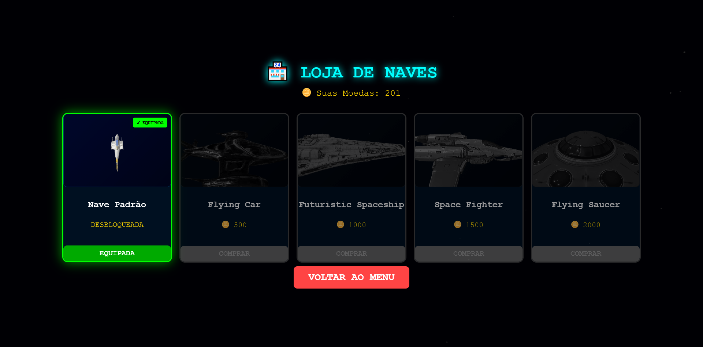
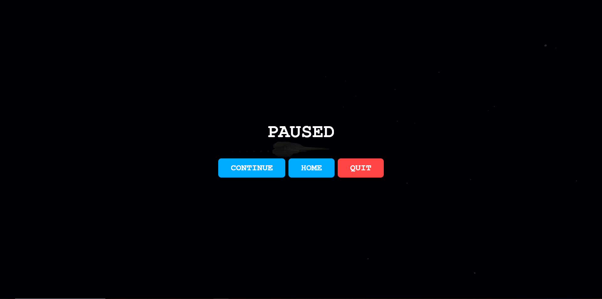
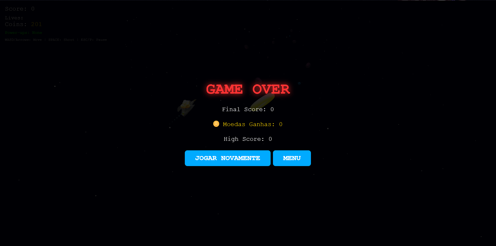

# 🚀 Space Runner 3D

## 📖 Sobre o Jogo

**Space Runner 3D** é um jogo de arcade espacial onde você controla uma nave futurística em uma jornada infinita através do cosmos. Desvie de asteroides, colete power-ups e sobreviva o máximo possível enquanto a velocidade aumenta gradualmente!

### 🎯 Objetivo

Sobreviver o maior tempo possível desviando de asteroides e destruindo-os com seus projéteis. Colete orbs verdes para aumentar sua pontuação e power-ups para obter habilidades especiais. Compita por sua melhor pontuação e desbloqueie novas naves na loja!

### ✨ Recursos Principais

- **5 Naves Jogáveis**: Desbloqueie e equipe diferentes modelos 3D de naves
- **Sistema de Loja**: Ganhe moedas jogando e compre novas naves (10 pontos = 1 moeda)
- **Power-ups Estratégicos**: Escudo, Tiro Rápido, Câmera Lenta e Disparo Triplo
- **Modelos 3D em GLB**: Naves, asteroides e coletáveis renderizados em 3D
- **Sistema de Progressão**: Moedas persistentes e progresso salvo no localStorage
- **Música Dinâmica**: 3 trilhas (menu, gameplay, pause)
- **Dificuldade Progressiva**: Velocidade aumenta gradualmente com a pontuação

## 🛠️ Ferramenta Utilizada

- **Babylon.js v8.37.1**: Engine 3D WebGL para renderização e física
- **JavaScript ES6+**: Classes, módulos, arrow functions
- **HTML5 Canvas**: Renderização via WebGL
- **CSS3**: Interface e animações
- **localStorage**: Persistência de dados (moedas, naves desbloqueadas)

## 📦 Execução

### Pré-requisitos

- Navegador moderno (Chrome, Firefox, Edge, Safari)
- Acessar o link https://theml.itch.io/space-runner-3d


## 🎮 Controles

| Tecla       | Ação                |
| ----------- | ------------------- |
| **W / ↑**   | Mover para cima     |
| **S / ↓**   | Mover para baixo    |
| **A / ←**   | Mover para esquerda |
| **D / →**   | Mover para direita  |
| **ESPAÇO**  | Atirar              |
| **ESC / P** | Pausar/Despausar    |

## 🎁 Power-ups

| Ícone | Nome            | Efeito                       | Duração    |
| ----- | --------------- | ---------------------------- | ---------- |
| 🛡️    | **Shield**      | Protege contra 1 colisão     | Até usar   |
| 🔥    | **Rapid Fire**  | Disparo mais rápido          | 300 frames |
| ⏱️    | **Slow Motion** | Reduz velocidade pela metade | 300 frames |
| 🔺    | **Triple Shot** | Disparo triplo               | 300 frames |

## 🏪 Sistema de Loja

Ganhe moedas jogando e desbloqueie novas naves:

| Nave                    | Preço   | Status       |
| ----------------------- | ------- | ------------ |
| 🚀 Nave Padrão          | Grátis  | Desbloqueada |
| 🚗 Flying Car           | 500 🪙  | Comprar      |
| 🛸 Futuristic Spaceship | 1000 🪙 | Comprar      |
| ✈️ Space Fighter        | 1500 🪙 | Comprar      |
| 🛸 Flying Saucer        | 2000 🪙 | Comprar      |

**Conversão**: 10 pontos = 1 moeda

## 📊 Sistema de Pontuação

- **+1 ponto**: Cada asteroide que passa sem colidir
- **+5 pontos**: Destruir asteroide com projétil ou coletar power-up
- **+10 pontos**: Coletar orb verde (coletável)

## 🎵 Trilha Sonora

- **Menu**: Stardust Whispers.mp3
- **Gameplay**: Running Through the Stars.mp3
- **Pause**: Galactic-Drift.mp3

## 📁 Estrutura do Projeto

## 📁 Estrutura do Projeto

```
Space Runner 3D/
├── index.html              # Página principal do jogo
├── README.md              # Documentação do projeto
├── css/
│   └── styles.css         # Estilos e layout
├── js/
│   ├── constants.js       # Constantes e configurações
│   ├── gameState.js       # Gerenciamento de estado
│   ├── gameController.js  # Controlador principal
│   ├── gameLoop.js        # Loop de atualização
│   ├── player.js          # Lógica da nave
│   ├── entities.js        # Factory de entidades
│   ├── powerups.js        # Sistema de power-ups
│   ├── weapons.js         # Sistema de armas
│   ├── shop.js            # Sistema de loja
│   ├── ui.js              # Interface do usuário
│   └── input.js           # Controles de teclado
└── assets/
    ├── player/            # Modelos 3D das naves (.glb)
    ├── entities/          # Asteroides e coletáveis (.glb)
    └── sounds/            # Trilhas sonoras (.mp3)
```

## 🏗️ Arquitetura do Código

### Módulos Principais

**`gameController.js`** - Coordena todos os sistemas

- Inicializa Babylon.js Engine e Scene
- Gerencia música (3 tracks)
- Integra ShopManager e Player
- Controla fluxo do jogo (start, pause, resume, game over)

**`gameLoop.js`** - Loop principal de atualização

- Atualiza todas as entidades (60 FPS)
- Detecta colisões
- Gerencia spawn de objetos
- Sistema de velocidade progressiva

**`player.js`** - Controle da nave do jogador

- Carregamento dinâmico de modelos GLB
- Sistema de movimento e hitbox invisível
- Efeito visual de invulnerabilidade
- Método `updateModel()` para trocar naves

**`entities.js`** - Factory de entidades

- Cria asteroides com modelos 3D
- Cria coletáveis (Orb.glb)
- Cria power-ups e projéteis
- Sistema de fallback para modelos

**`shop.js`** - Sistema de economia

- Gerencia moedas e progresso
- Conversão de pontos (10:1)
- Persistência com localStorage
- Compra e equipamento de naves

**`powerups.js`** - Sistema de power-ups

- Gerencia duração de efeitos
- Aplica modificadores (escudo, velocidade, etc.)
- Atualiza UI em tempo real

**`ui.js`** - Interface do usuário

- Atualiza HUD (score, vidas, moedas)
- Gerencia telas (menu, pause, game over, loja)
- Mostra coletáveis ganhos

**`input.js`** - Sistema de input

- Captura eventos de teclado
- Mapeia teclas para ações
- Integração com GameController

## 🎨 Características Técnicas

### Padrões de Design

- **Factory Pattern**: Criação de entidades
- **Singleton**: GameStateManager
- **Observer**: Sistema de eventos
- **Module Pattern**: Organização em arquivos separados

### Otimizações

- **Object Pooling**: Reutilização de partículas
- **Detecção de travamento**: Remove asteroides presos
- **Cleanup automático**: Libera memória de previews 3D
- **Lazy Loading**: Modelos carregados sob demanda

### Babylon.js Features

- SceneLoader para GLB
- ArcRotateCamera
- Múltiplas fontes de luz
- TransformNode para hierarquias
- registerBeforeRender para game loop

## 🐛 Debugging e Validações

O jogo inclui múltiplas camadas de validação:

1. **Asteroides travados**: Detecta e remove após 30 frames sem movimento
2. **Posições inválidas**: Remove asteroides em (0,0,0) ou fora dos limites
3. **Modelos GLB**: Timeout de 5s com fallback visual
4. **Meshes válidos**: Valida geometria antes de adicionar à cena
5. **Velocidade controlada**: Impede bugs de slow motion persistente

## 🚀 Como Executar

1. **Clone o repositório** ou baixe os arquivos
2. **Abra um servidor HTTP local** (veja opções acima)
3. **Acesse** http://localhost:8000
4. **Divirta-se!** 🎮

## 📸 Capturas de Tela

### Menu Principal



### Gameplay



### Loja de Naves



### Pause



### Game Over



## 🎯 Requisitos Atendidos

### ✅ Repositório Público

- Código-fonte completo organizado
- README.md detalhado
- Estrutura de pastas clara

### ✅ Criatividade (10 pts)

- Sistema de progressão com loja
- 5 modelos de naves desbloqueáveis
- Economia de moedas persistente
- Power-ups estratégicos

### ✅ Jogabilidade e UX (10 pts)

- Controles responsivos (WASD/Arrows)
- Feedback visual (invulnerabilidade, explosões)
- 3 trilhas sonoras dinâmicas
- Interface clara e intuitiva

### ✅ Uso do Babylon.js (5 pts)

- Modelos GLB carregados corretamente
- Iluminação e câmera configuradas
- SceneLoader e TransformNode
- Engine otimizado para 60 FPS

### ✅ Desempenho (10 pts)

- Sem bugs críticos
- Sistema de detecção de travamento
- Validações múltiplas
- Performance estável

### ✅ Documentação (5 pts)

- README completo
- Instruções claras
- Estrutura organizada
- Comentários no código

## 👥 Equipe

Luis Gustavo Theml, Marciana Pereira e Maicon Oliveira

## 🙏 Créditos

- **Engine**: Babylon.js
- **Modelos 3D**: Modelos 3D criados através das ferramentas meshy e tripo3d
- **Músicas**: Trilha sonora criada através da ferramenta Suno

---

**Desenvolvido para:** Disciplina Desenvolvimento de Jogos Digitais 
**Professor(a):** Cristian Rachid  
**Instituição:** UniAcademia
**Ano:** 2025

